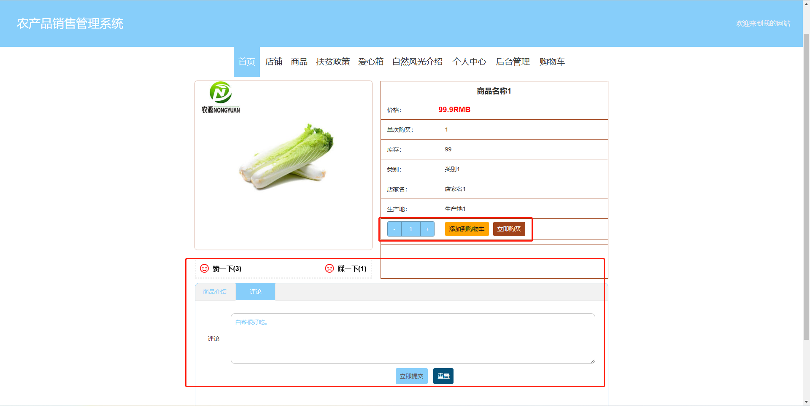
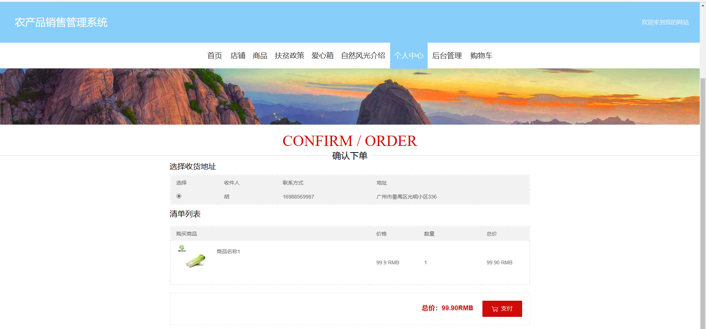
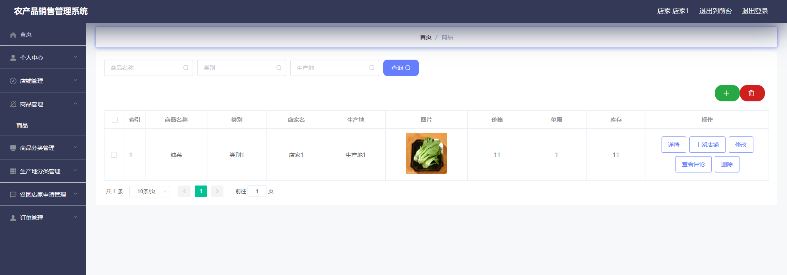
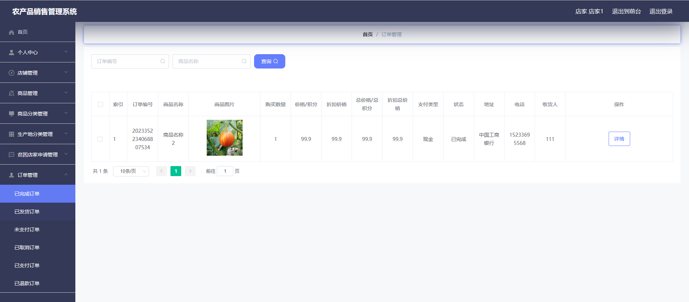
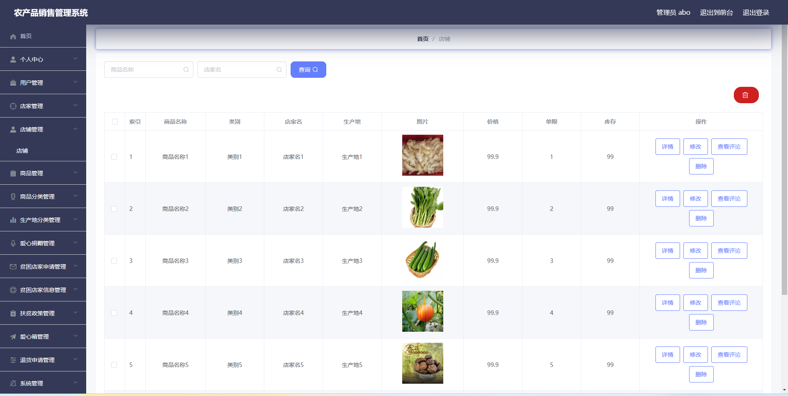
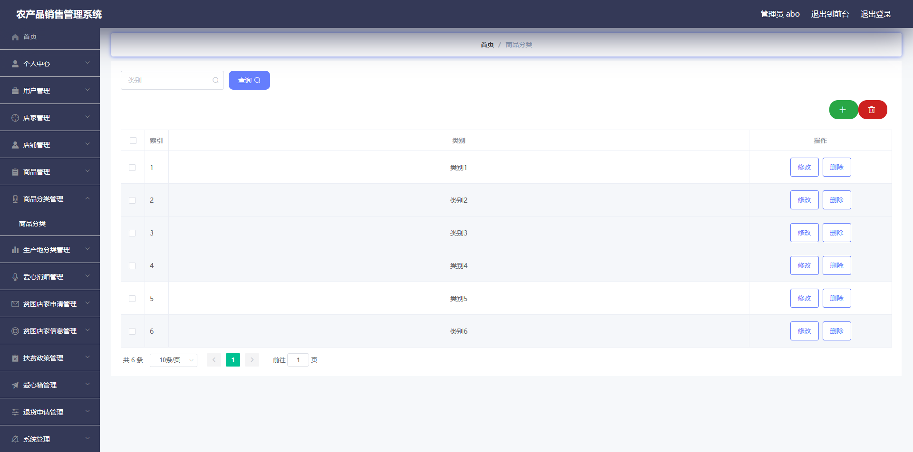
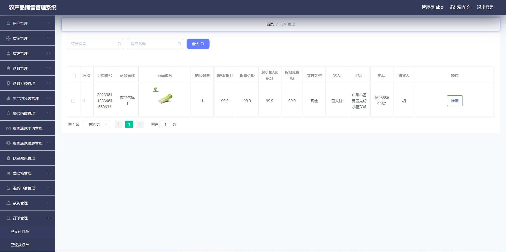

# 农产品销售管理系统

## 介绍

基于SpringBoot和Mybatis的农产品销售系统/商城

开发语言：java

运行环境:idea或eclipse 数据库:mysql

## 一、项目功能介绍
本系统分为用户、店家和管理员三种角色；

### 1、用户模块主要功能包括：

1、登录/注册，2、主页浏览，3、商家店铺浏览，4、评论浏览，5、发表评论，6、农产品浏览，7、自然风光介绍，8、修改个人信息，9、查看农产品介绍，10、修改个人资料，11、查看订单，12、编辑收获地址，13、收藏农产品和查看收藏，14、购买农产品，15、查看购物车，16、申请退货，17、查看农业扶贫信息，18、爱心捐赠

### 2、商家模块主要功能包括：

1、修改密码，2、修改商家信息，3、商品管理，4、商品分类管理，5、生成地分类管理，6、贫困店家申请管理，7、订单管理

### 3、管理员模块主要功能包括：
1、修改密码和个人，2、用户管理（新增用户和删除用户），3、商家管理（新增商家和删除商家），4、店铺管理，5、商品管理，6、商品分类管理，7、生产产地分类管理，8、爱心捐赠管理，9、贫困店家申请管理，10、贫困店家信息管理，11、爱心箱管理，12、退款申请管理，13、轮播图管理，14、自然风光管理，15、全部订单管理

### 完整项目获取

通过网盘分享的文件：农产品销售管理系统

链接: https://pan.baidu.com/s/169IUPPGvW61Jcbw6VJbNlQ?pwd=hnzk 提取码: hnzk
--来自百度网盘超级会员v3的分享

通过网盘分享的文件：工具包

链接: https://pan.baidu.com/s/1YmdoJvkjoUjA75wvHLDZ6A?pwd=xm96 提取码: xm96
--来自百度网盘超级会员v3的分享

需要远程项目部署或项目修改和毕业设计也可联系（添加申请时请备注好来意）

通过网盘分享的文件：远程调试部署联系方式

链接: https://pan.baidu.com/s/1W0dDcoZmayG0c7USJDYBYg?pwd=nqd7 提取码: nqd7
--来自百度网盘超级会员v3的分享

### 项目合集(项目不断更新中)
链接: https://pan.baidu.com/s/1nY-zhvAK0CXYcn3g7LzQnQ?pwd=id3c 提取码: id3c
--来自百度网盘超级会员v3的分享

#### 这些项目一起发你了 可以分享给你需要的同学 调试可找我 也接二次修改和项目定制、毕业设计等

## 接毕业设计和论文

微信联系方式：xzxj0206  QQ：3808981644   (支持修改、 部署调试、 支持代做毕设)

接网站建设、小程序、H5、APP、各种系统等，单片机、嵌入式也可以做

选题+开题报告+任务书+程序定制+安装调试+论文+答辩ppt  都可以做

## 二、部分页面展示

### 1、用户模块部分功能页面展示

### 2、商家模块部分功能页面展示

### 3、管理员模块部分功能页面展示

